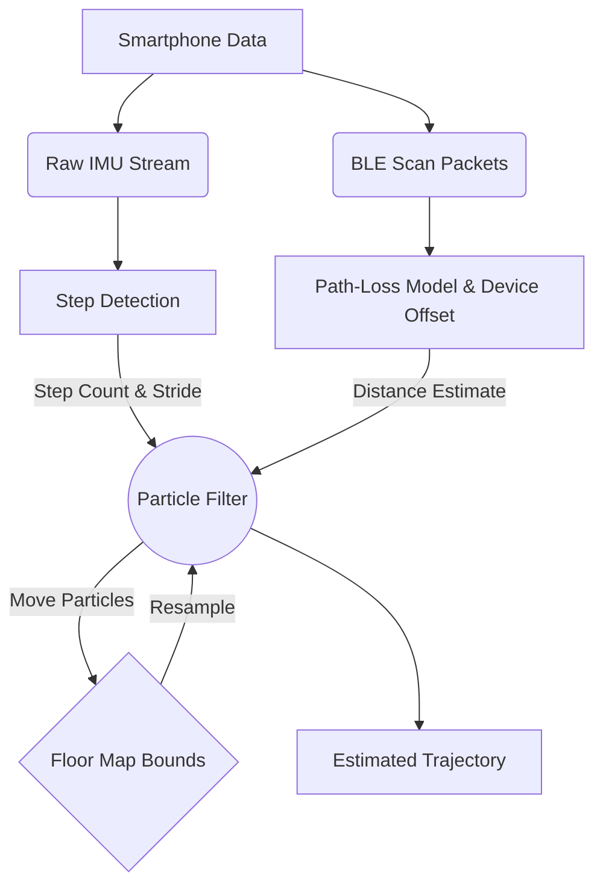
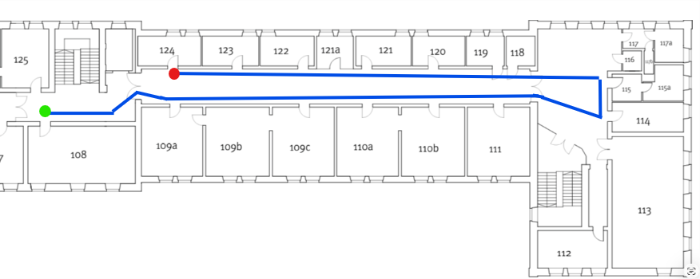

# Navigating the Great Indoors: Building a Cross-Device BLE Localization System

Ever tried to find a specific conference room in a massive office building, only to watch your phone's GPS dot bounce wildly across the screen or disappear entirely? We've all been there. 

While satellite navigation has mapped the outdoor world down to the nearest inch, the moment we step inside a concrete and steel building, we're effectively flying blind. We decided it was time to fix that.

## The Problem: Why Indoor Navigation is Broken

Why is it so hard to build a "Google Maps for the indoors"? 

The core issue is that GPS signals are too weak to penetrate building materials reliably. To bridge this gap, engineers have tried various indoor positioning systems (IPS) using Wi-Fi, ultra-wideband (UWB), or computer vision. However, these solutions usually suffer from severe bottlenecks:
* **Costly Infrastructure:** UWB requires expensive hardware installations.
* **Power Drain:** Continuous camera or Wi-Fi scanning destroys smartphone battery life.
* **Hardware Fragmentation:** An algorithm that works perfectly on a flagship phone often fails completely on a budget device because the antennas and sensors are entirely different.

We needed a system that was cheap to deploy, battery-efficient, and—crucially—robust enough to handle the wild wild west of different Android smartphone models.

## Our Approach: BLE Beacons + IMU Magic

Rather than reinventing the wheel, our attempt at solving this problem relies on a hybrid localization system using two things nearly every modern building and smartphone already have: **Bluetooth Low Energy (BLE)** and **Inertial Measurement Units (IMUs)**.

If you think of indoor navigation like walking through a dark room:
1. **The IMU (Accelerometer & Gyroscope)** acts as your inner sense of balance and movement. It tells you, "I just took three steps forward."
2. **The BLE Beacons** act as dimly lit exit signs. By measuring how bright the signal is (the RSSI, or Received Signal Strength Indicator), you can estimate how far you are from a known location.

By combining the two, our system tracks a user seamlessly across multiple floors, even starting from a "global cold start" (where the app has zero idea where you are when you open it). 

## Under the Hood: How We Track You

Our localization engine is built using Python, leveraging `pandas`, `scipy`, and `matplotlib`. At the heart of the system is a **Particle Filter**. 

Here is how the pipeline breaks down:

### 1. Step Detection
We process the raw IMU data streams using Butterworth low-pass filters and peak-detection algorithms (`scipy.signal.find_peaks`). By analyzing the rhythmic spikes in the accelerometer, we accurately count physical steps. We mapped our environment's stride length to an average of 0.70 meters. 

### 2. The BLE Path-Loss Model
We mounted a series of named beacons (`arrive_emi1`, `arrive_emi2`, etc.) along the corridors of our two-story building. As the user walks, the phone logs the BLE scan packets. Using a logarithmic path-loss model, we translate signal strength into a noisy distance estimate.

### 3. The Particle Filter
Because phone sensors drift and Bluetooth signals bounce randomly off walls and human bodies, neither the IMU nor the BLE data is perfect. 
Our Particle Filter generates hundreds of virtual "guesses" (particles) of where the user might be. 
* When the IMU detects a step, we move all particles forward.
* When the phone hears a Bluetooth beacon, we score each particle. Particles close to the beacon's expected signal strength survive; particles that ended up in a wall or on the wrong floor "die" and are resampled. 

Over a few seconds, the cloud of particles collapses perfectly onto the user's actual location.

To give you an idea of our testing ground, here is the true, physical path we walked during our baseline data collection run:

And here is our Particle Filter in action, predicting that exact same trajectory from a cold start using nothing but sensor math:

## The Ultimate Challenge: Smartphone Hardware Fragmentation

Our biggest technical hurdle wasn't the math—it was the phones. 

During our data collection phases (Runs 1-5), everything worked beautifully on our primary test device. But when we introduced new phones, the system fell apart. 

**The issue:** Phone_A, Phone_B, and Phone_C will all report entirely different RSSI (signal strength) values even when sitting on the exact same table. 

If the system expects -65 dBm at a distance of 2 meters, but Phone_C's antenna naturally reads -72 dBm, the Particle Filter assumes the user is in a different room entirely.

### How we solved it:
We engineered a cross-device calibration protocol (Run 6). We placed all target devices at a static location (2 meters in front of `arrive_emi2`) and recorded the raw Bluetooth streams simultaneously. We discovered that devices have distinct, persistent hardware biases. For example, Phone_B consistently read +4.00 dB higher than our baseline. 

We integrated these offsets directly into our initialization code. Now, when the app boots, it identifies the device model and applies the pre-calculated RSSI offset before feeding the data to the Particle Filter. Our multi-phone loop-closure tests (Runs 7-9) confirmed that the system can now seamlessly track a user up and down staircases, regardless of which phone is in their pocket.

## Looking Forward

Indoor navigation doesn't have to require million-dollar hardware overhauls. By combining smart probabilistic filters with ubiquitous smartphone sensors and cheap Bluetooth beacons, we've built a system that is accurate, resilient, and hardware-agnostic. 

We are incredibly proud of how this project bridges the gap between raw hardware signals and intuitive user experiences. 

**Want to see the code or try it yourself?** Check out the [GitHub repository](https://github.com/tanish-ml/Cross-Device-BLE-Localization-System), run the `testing.ipynb` harness, and let us know your thoughts in the comments below!
